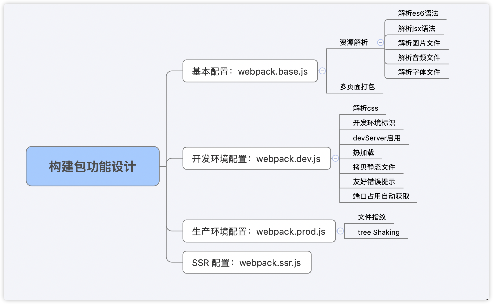

## 主体设计
<center>

</center>
## 期望
* * *
 通过多个配置文件管理不同环境的 webpack 配置，并抽离成 npm 包统一管理。业务开发者只需要安装该 npm 包，并且根据具体环境需要引用对应的配置文件即可.

## 构思
* * *
> 多环境配置：
- 基本配置：webpack.base.js
- 开发环境配置：webpack.dev.js
- 生产环境配置：webpack.prod.js
- SSR 配置：webpack.ssr.js

...
> 抽成npm包管理
- 规范：git commit日志，README，ESLint规范，Semver规范
- 质量：冒烟测试，单元测试，测试覆盖率和CL
> 功能模块设计

## 目录结构
```text
.
├── config
├── lib
├── src
│   └── resume
│       ├── fonts
│       ├── images
│       ├── js
│       ├── pdf
│       └── styles
└── test
    ├── smoke
    └── unit
```

## 规范的 commit (Angular规范)
> commit message
- **commit message 分3个部分：head, body, footer**
    - **head**: (type) (scop): subject
        - **type**: feat, fix, docs, style, refactor, test, chore, revert, perf, build
        - **score**: 影响范围
        - **subject**: 简短描述（动词开头，首字母小写，结尾不加.）
    - **body**: 详细描述
    - **footer**: (1) 不兼容改动；(2) 关闭issue
- **revert 有特殊的格式**
 ```
 # head: revert: <要被撤销的commit的head>
# body: This reverts commit <commit-hash>.
# eg:
	revert: docs add README.md
	This reverts commit a2d04c0b914785e4ff0cdf4baeea84d8611c7a61.

 ```